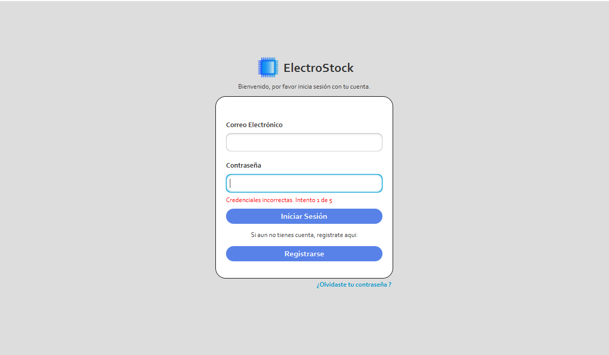
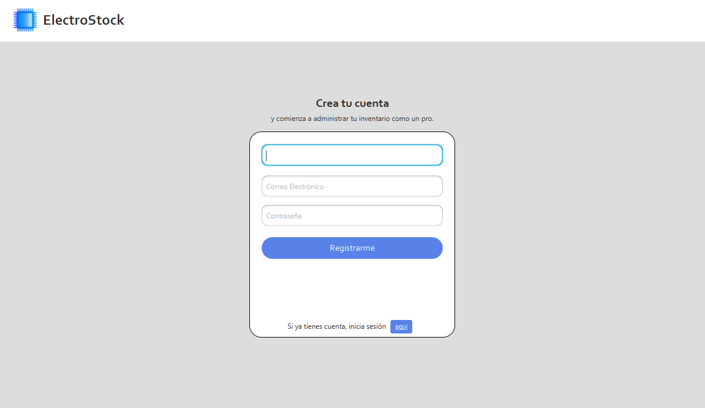
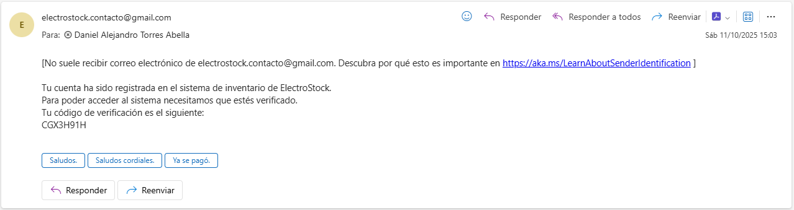
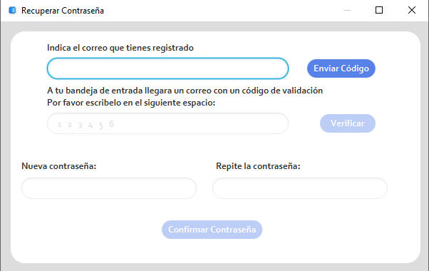
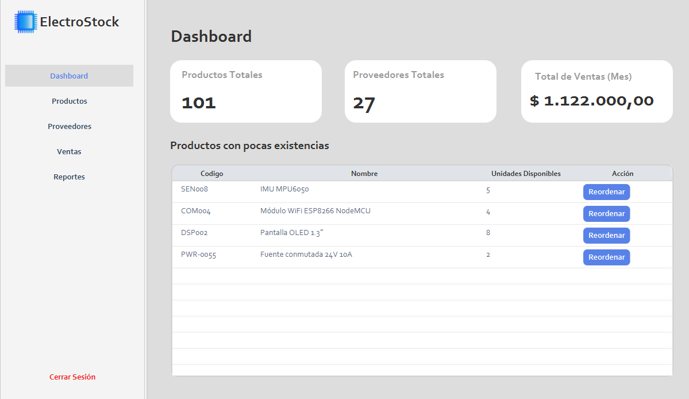
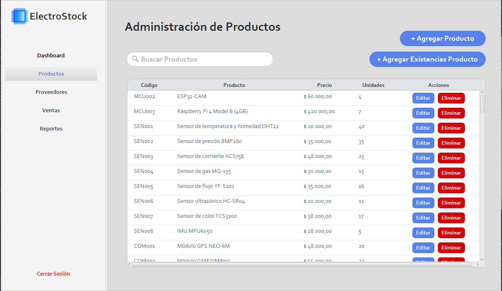
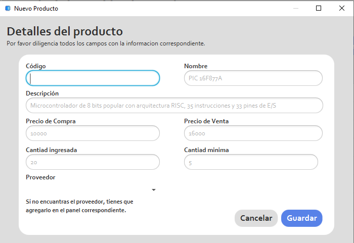
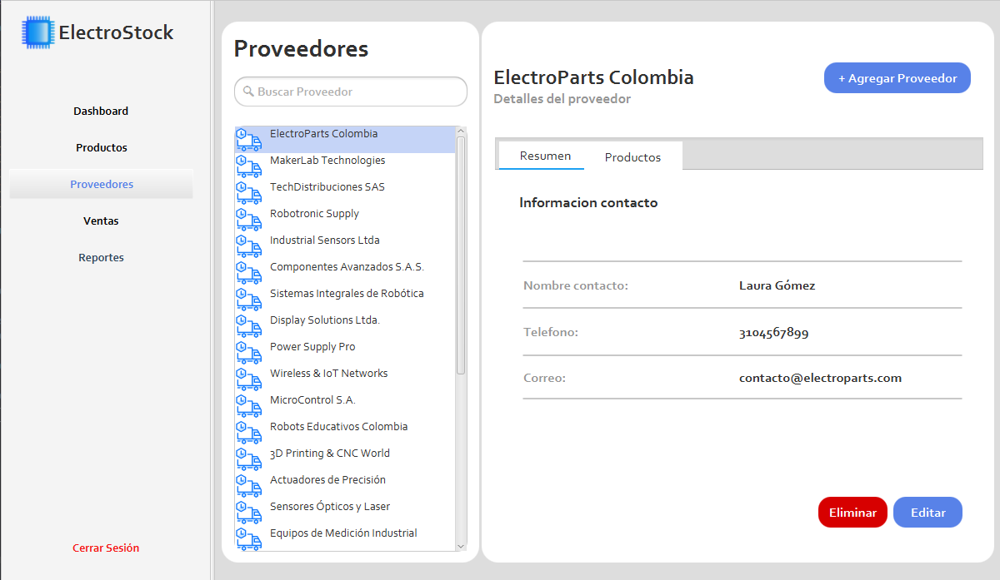
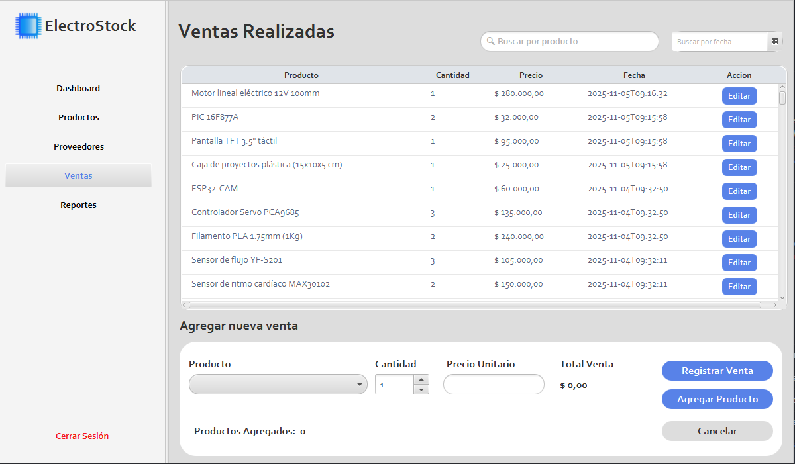
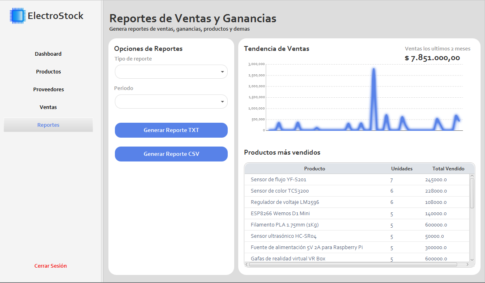

# 🧭 Manual de Usuario — ElectroStock

## 📘 Introducción

**ElectroStock** es una aplicación de escritorio desarrollada en **JavaFX** con conexión a una base de datos **MySQL**, diseñada para optimizar la gestión de inventarios, productos, proveedores y ventas en tiendas del sector electrónico.

El sistema permite registrar productos, administrar el stock, registrar movimientos de inventario, gestionar usuarios y realizar el control de ventas de manera eficiente y centralizada.

Este documento describe de forma técnica y detallada el uso de cada módulo de la aplicación, con el propósito de garantizar una correcta operación del sistema y la comprensión de sus principales funcionalidades.  
Cada sección incluye capturas de pantalla y procedimientos secuenciales que orientan al usuario en el manejo adecuado del software.

---

## 📂 Requisitos del Sistema

### Requisitos de Hardware
- Procesador: Intel Core i3 o superior
- Memoria RAM: 4 GB mínimo
- Espacio en disco: 200 MB libres
- Resolución de pantalla mínima: 1280x720

### Requisitos de Software
- Sistema operativo: Windows 10 / 11 (64 bits)
- Java Runtime Environment (JRE) 21 o superior
- MySQL Server 8.0 o superior
- Conexión local activa a la base de datos

---

## ⚙️ Instalación y Primera Ejecución

1. **Instalación de MySQL:**
    - Instale MySQL Server 8.0 o superior y cree un usuario con privilegios administrativos.
    - Verifique que el servicio de MySQL se encuentre en ejecución.

2. **Ejecución de la Aplicación:**
    - Ejecute el archivo `ElectroStock.exe` o, alternativamente, el archivo `ElectroStock.jar`.
    - En el primer inicio, el sistema detectará la ausencia de la base de datos y la creará automáticamente.

3. **Conexión a la Base de Datos:**
    - Por defecto, la aplicación utiliza los parámetros definidos en la clase de conexión:
      ```
      URL: jdbc:mysql://localhost:3306/inventariotiendadb  
      Usuario: root  
      Contraseña: [definida en configuración]
      ```
    - Si la conexión no puede establecerse, revise las credenciales en el archivo de configuración o en el código fuente (paquete `com.sistema.util`).

---

## 🔐 Inicio de Sesión

Al iniciar la aplicación, se muestra la **ventana de autenticación de usuario**, donde se debe ingresar el **nombre de usuario** y la **contraseña registrada**.  
El sistema valida los datos contra la base de datos y, si son correctos, permite el acceso al menú principal.

> ⚠️ **Nota:** Los usuarios deben estar previamente registrados por un administrador autorizado.



### Descripción de la interfaz

| Elemento | Descripción |
|-----------|-------------|
| **Correo Electrónico** | Campo de entrada donde el usuario debe ingresar su correo registrado. |
| **Contraseña** | Campo de entrada para la clave de acceso. Por motivos de seguridad, los caracteres se ocultan al escribir. |
| **Botón “Iniciar Sesión”** | Envía las credenciales al sistema para su validación en la base de datos. Si los datos son correctos, el usuario accede al menú principal. |
| **Mensaje de error** | En caso de credenciales incorrectas, se muestra el mensaje *“Credenciales incorrectas. Intento n de 5”*, indicando el número de intentos realizados. |
| **Botón “Registrarse”** | Redirige a la vista de registro para crear una nueva cuenta de usuario. |
| **Enlace “¿Olvidaste tu contraseña?”** | Permite recuperar la contraseña mediante correo electrónico (si la función está habilitada). |

### Funcionalidad de seguridad

- El sistema **limita a cinco intentos consecutivos** de inicio de sesión fallido por cuenta.
- Si se excede el número de intentos permitidos, la cuenta se bloquea temporalmente para prevenir accesos no autorizados.
- Las contraseñas se almacenan utilizando **hash seguro (bcrypt o SHA-256)** en la base de datos.

### Recomendaciones

- Verifique que el servicio **MySQL** esté en ejecución antes de iniciar sesión.
- Si el mensaje “Error de conexión con la base de datos” aparece, confirme los parámetros de conexión en la clase `ConexionMySQL`.
- En caso de olvidar la contraseña, utilice la opción de recuperación o contacte al administrador del sistema.

## 🧾 Registro de Usuario

La vista de **registro** permite crear una nueva cuenta en el sistema **ElectroStock**.  
Cada usuario debe registrar un **nombre**, **correo electrónico** válido y una **contraseña segura** para acceder al sistema posteriormente.



### Descripción de la interfaz

| Elemento | Descripción |
|-----------|-------------|
| **Nombre de Usuario** | Campo obligatorio para identificar al usuario dentro del sistema. |
| **Correo Electrónico** | Dirección válida a la cual se enviará un código de verificación. |
| **Contraseña** | Clave de acceso personal que será cifrada y almacenada de forma segura en la base de datos. |
| **Botón “Registrarme”** | Inicia el proceso de creación de cuenta y envío del código de verificación. |
| **Enlace “Inicia sesión aquí”** | Permite regresar a la ventana de inicio de sesión en caso de tener una cuenta existente. |

### Proceso de verificación

Una vez que el usuario completa los campos y selecciona **“Registrarme”**:

1. El sistema envía automáticamente un **correo de verificación** con un código único.
2. Se habilitan los **campos adicionales** para ingresar dicho código directamente en la interfaz.
3. Si el código ingresado es correcto, la cuenta se marca como **verificada** en la base de datos (`verificado = 1`).
4. Solo después de una verificación exitosa, el usuario podrá **iniciar sesión** en el sistema.

> ⚠️ **Importante:**  
> Los usuarios **no verificados** no pueden autenticarse. Esto garantiza la validez de las direcciones de correo y protege el acceso al sistema.


### Captura del correo de verificación
Una vez pulsado **“Registrarme”**, el sistema genera un **código de 6 caracteres alfanuméricos** y lo envía al correo indicado.  
A continuación se muestra la captura real del mensaje recibido:



| Elemento del correo | Descripción |
|---------------------|-------------|
| **Remitente** | `electrostock.contacto@gmail.com` |
| **Destinatario** | El correo ingresado por el usuario durante el registro. |
| **Asunto** | (No visible en la captura, pero configurado como) `Código de verificación – ElectroStock` |
| **Cuerpo del mensaje** | Incluye:<br>• Confirmación de registro.<br>• Instrucción para verificar la cuenta.<br>• **Código resaltado en negrita** (ejemplo: `CGX9H91H`).<br>• Enlace de identificación del remitente (Gmail). |
| **Validez** | El código expira a los **10 minutos** de su generación. |

> ⚠️ **Consejo:** Si el correo no aparece en la bandeja de entrada,
> revise la carpeta **Spam / Correo no deseado**. El mensaje incluye un aviso de identificación del remitente (`[No suele recibir correo electrónico de electrostock.contacto@gmail.com...]`).
### Recomendaciones

- Utilice una dirección de correo válida y accesible para recibir el código de verificación.
- Si el mensaje de verificación no llega en un lapso breve, revise la carpeta de *correo no deseado (spam)*.
- Mantenga su contraseña confidencial y evite utilizar contraseñas comunes.  

## 🔐 Recuperación de Contraseña

La vista de **Recuperar Contraseña** permite restablecer el acceso de un usuario registrado en caso de haber olvidado su clave.  
El proceso garantiza la seguridad de la cuenta mediante el envío de un código de validación al correo electrónico asociado.



### Descripción de la interfaz

| Elemento | Descripción |
|-----------|-------------|
| **Campo de correo electrónico** | Permite ingresar la dirección de correo registrada en el sistema. |
| **Botón “Enviar Código”** | Envía un mensaje con un código de validación al correo indicado. |
| **Campo de código de verificación** | Espacio para introducir el código recibido en el correo electrónico. |
| **Botón “Verificar”** | Confirma la validez del código ingresado y habilita los campos para definir una nueva contraseña. |
| **Campos “Nueva contraseña” y “Repite la contraseña”** | Permiten establecer una nueva clave de acceso de manera segura. |
| **Botón “Confirmar Contraseña”** | Guarda la nueva contraseña cifrada en la base de datos, completando el proceso de recuperación. |

### Flujo del proceso

1. El usuario introduce su **correo electrónico registrado** y presiona **“Enviar Código”**.
2. El sistema genera un **código temporal de seis dígitos** y lo envía al correo proporcionado.
3. Una vez recibido el código, el usuario debe ingresarlo en el campo correspondiente y presionar **“Verificar”**.
4. Si la verificación es correcta, se habilitan los campos para establecer una nueva contraseña.
5. Tras ingresar y confirmar la nueva clave, el sistema actualiza la información en la base de datos y muestra un mensaje de confirmación.

> ⚠️ **Nota de seguridad:**  
> El código de verificación tiene una validez limitada. Si expira, deberá solicitarse nuevamente mediante el botón **“Enviar Código”**.

### Recomendaciones

- Verifique que el correo ingresado coincida con el utilizado en el registro de la cuenta.
- No comparta su código de verificación ni su nueva contraseña con terceros.
- Utilice contraseñas robustas que combinen letras, números y caracteres especiales. 

## 📊 Dashboard del Sistema

La vista **Dashboard** proporciona una visión general del estado actual del sistema, mostrando información clave sobre productos, proveedores y ventas.  
Su objetivo es ofrecer un resumen rápido de los indicadores principales para facilitar la toma de decisiones.



### Descripción de la interfaz

| Elemento | Descripción |
|-----------|-------------|
| **Menú lateral** | Permite la navegación entre las diferentes secciones del sistema: *Dashboard, Productos, Proveedores, Ventas y Reportes.* |
| **Productos Totales** | Muestra la cantidad total de productos registrados en la base de datos. |
| **Proveedores Totales** | Indica el número total de proveedores activos en el sistema. |
| **Total de Ventas (Mes)** | Refleja el valor monetario acumulado de las ventas realizadas durante el mes en curso. |
| **Tabla “Productos con pocas existencias”** | Lista los artículos cuyo stock se encuentra por debajo del umbral establecido, indicando su código, nombre, unidades disponibles y una acción para reordenar. |
| **Botón “Reordenar”** | Permite generar una orden de reposición para el producto correspondiente. |
| **Botón “Cerrar Sesión”** | Finaliza la sesión activa del usuario y redirige a la pantalla de inicio de sesión. |

### Funcionamiento

1. Al acceder al **Dashboard**, el sistema consulta automáticamente la base de datos para obtener las métricas actuales de productos, proveedores y ventas mensuales.
2. Los valores se presentan de manera resumida en tarjetas informativas ubicadas en la parte superior de la vista.
3. La sección inferior muestra una tabla dinámica que lista los productos con **bajas existencias**.
4. Al presionar **“Reordenar”**, el sistema abre una ventana o formulario para gestionar la reposición del inventario del producto seleccionado.
5. El usuario puede desplazarse hacia otras secciones mediante el menú lateral sin necesidad de recargar la aplicación.

### Recomendaciones

- Revisar periódicamente los productos con baja disponibilidad para evitar interrupciones en las ventas.
- Mantener actualizada la información de proveedores para agilizar las órdenes de reabastecimiento.
- Cerrar sesión al finalizar el uso del sistema para proteger la información de acceso.  

## 📦 Administración de Productos

La vista **Administración de Productos** permite gestionar el inventario del sistema, ofreciendo herramientas para registrar, editar, eliminar y actualizar las existencias de los productos disponibles.



### Descripción de la interfaz

| Elemento | Descripción |
|-----------|-------------|
| **Campo “Buscar Productos”** | Permite localizar rápidamente un producto por nombre o código dentro del inventario. |
| **Botón “+ Agregar Producto”** | Abre un formulario para registrar un nuevo producto en la base de datos, solicitando información como código, nombre, precio y unidades iniciales. |
| **Botón “+ Agregar Existencias Producto”** | Permite aumentar la cantidad de unidades disponibles de un producto previamente registrado. |
| **Tabla de productos** | Muestra la lista completa de artículos registrados, incluyendo su código, nombre, precio y unidades disponibles. |
| **Botón “Editar”** | Abre una ventana para modificar los datos del producto seleccionado. |
| **Botón “Eliminar”** | Permite eliminar un producto de la base de datos de manera permanente, previa confirmación del usuario. |

### Funcionamiento

1. Al acceder al módulo de **Productos**, el sistema carga automáticamente todos los registros almacenados en la base de datos.
2. El usuario puede buscar un producto específico utilizando el campo de búsqueda.
3. Mediante el botón **“+ Agregar Producto”**, se pueden añadir nuevos artículos al inventario.
4. Si un producto requiere actualización de stock, se utiliza el botón **“+ Agregar Existencias Producto”** para incrementar las unidades.
5. Los botones **“Editar”** y **“Eliminar”** permiten modificar o eliminar los productos existentes de forma individual.
6. Toda modificación se guarda automáticamente en la base de datos, garantizando la integridad del inventario.

### Recomendaciones

- Antes de eliminar un producto, verificar que no esté asociado a registros de venta activos.
- Mantener actualizados los precios y cantidades disponibles para garantizar la precisión de los reportes.
- Realizar copias de seguridad de la base de datos periódicamente para evitar pérdida de información.  

### Menú “Agregar un Producto”
Al pulsar el botón **“+ Agregar Producto”** se abre el formulario modal **“Nuevo Producto”**.  
A continuación la captura de pantalla del formulario completo:



### Descripción de la interfaz del formulario

| Elemento                | Descripción |
|-------------------------|-------------|
| **Código**              | Campo alfanumérico único (máx. 20 caracteres). Se valida en tiempo real contra la base de datos para evitar duplicados. |
| **Nombre**              | Nombre descriptivo del producto (obligatorio, máx. 100 caracteres). |
| **Descripción**         | Campo opcional para detalles técnicos o características (máx. 255 caracteres). |
| **Precio de Compra**    | Valor numérico con dos decimales que representa el costo de adquisición del producto. |
| **Precio de Venta**     | Valor numérico con dos decimales; debe ser **mayor** al precio de compra. |
| **Cantidad Ingresada**  | Cantidad inicial de unidades que se agregan al inventario al crear el producto (≥ 0). |
| **Cantidad Mínima**     | Umbral de stock bajo. Cuando el inventario alcance este valor, el producto aparecerá en la lista de “bajas existencias” del Dashboard. |
| **Proveedor**           | Menú desplegable con la lista de proveedores activos registrados en el sistema. |
| **Botón “Cancelar”**    | Cierra el formulario sin guardar cambios. |
| **Botón “Guardar”**     | Valida todos los campos obligatorios, comprueba reglas de negocio y persiste el registro en la tabla `productos`. |

### Flujo paso a paso

1. **Rellenar los campos obligatorios**:
    - `Código`, `Nombre`, `Precio de Venta`, `Cantidad Ingresada`.
2. **Completar datos recomendados**:
    - `Descripción`, `Precio de Compra`, `Cantidad Mínima`, `Proveedor`.
3. Pulsar **“Guardar”**.
4. El sistema realiza las siguientes validaciones:
    - El **código no debe existir** previamente.
    - `Precio de Venta > Precio de Compra` (si se ingresó).
    - `Cantidad Ingresada ≥ 0`.
    - `Cantidad Mínima ≥ 0`.
5. Si todo es correcto:
    - Se inserta el registro en la base de datos.
    - Se crea un **movimiento de entrada** automático en la tabla `movimientos_inventario` con tipo `INGRESO_INICIAL`.
    - La tabla principal de productos se actualiza en tiempo real.
6. Se muestra una notificación:
   > **“Producto registrado exitosamente (Código: XXX)”**

### Ejemplo de datos en la captura
| Campo | Valor de ejemplo |
|------|------------------|
| Código | `PIC16F877A` |
| Nombre | `PIC 16F877A` |
| Descripción | `Microcontrolador de 8 bits popular con arquitectura RISC, 35 instrucciones y 33 pines de E/S` |
| Precio de Compra | `10000` |
| Precio de Venta | `16000` |
| Cantidad Ingresada | `20` |
| Cantidad Mínima | `5` |

### Recomendaciones específicas

- Use códigos **únicos y descriptivos** (ej. `RES-10K-1/4W`, `CAP-100uF-16V`).
- Defina siempre una **Cantidad Mínima** realista para activar alertas tempranas de reposición.
- Si el proveedor no aparece en el desplegable, diríjase al módulo **Proveedores** para registrarlo primero.
- El campo **Precio de Compra** es clave para calcular el **margen de ganancia** en reportes futuros.

---

## 🚚 Administracion de Proveedores
La vista **Proveedores** permite gestionar la información de los proveedores asociados al inventario.  
Desde aquí se pueden **agregar**, **editar**, **eliminar** y **consultar** los datos de contacto y productos suministrados.



### Descripción de la interfaz

| Elemento | Descripción |
|--------|-------------|
| **Menú lateral** | Navegación rápida entre módulos: *Dashboard, Productos, Proveedores, Ventas, Reportes*. |
| **Campo “Buscar Proveedor”** | Filtra la lista en tiempo real por nombre del proveedor. |
| **Lista de proveedores** | Muestra todos los proveedores registrados con ícono representativo. Al hacer clic, se cargan sus detalles a la derecha. |
| **Botón “+ Agregar Proveedor”** | Abre formulario modal para registrar un nuevo proveedor. |
| **Pestañas “Resumen” y “Productos”** | <br>• **Resumen**: Información general y contacto.<br>• **Productos**: Lista de productos asociados al proveedor (no visible en captura actual). |
| **Sección “Información contacto”** | Muestra nombre del contacto, teléfono y correo electrónico. |
| **Botón “Eliminar”** (rojo) | Elimina permanentemente el proveedor seleccionado (requiere confirmación). |
| **Botón “Editar”** (azul) | Abre el formulario de edición con los datos actuales precargados. |
| **Botón “Cerrar Sesión”** | Finaliza la sesión activa. |

---

### Funcionamiento

1. Al ingresar al módulo, el sistema carga todos los proveedores desde la tabla `proveedores`.
2. Seleccionar un proveedor de la lista muestra sus datos en el panel derecho.
3. El botón **“+ Agregar Proveedor”** abre un formulario con campos:
    - Nombre de la empresa (obligatorio)
    - Nombre del contacto
    - Teléfono
    - Correo electrónico
    - Dirección (opcional)
    - Notas (opcional)
4. Al **editar**, todos los campos son modificables.
5. Al **eliminar**, se muestra un diálogo de confirmación:
   > **“¿Está seguro de eliminar a [Nombre Proveedor]? Esta acción no se puede deshacer.”**
6. Si el proveedor tiene productos asociados, se muestra advertencia:
   > **“No se puede eliminar: el proveedor tiene X productos vinculados.”**

---

### Ejemplo en pantalla (Proveedor seleccionado: *ElectroParts Colombia*)

| Campo | Valor |
|------|-------|
| **Nombre contacto** | Laura Gómez |
| **Teléfono** | 3104567899 |
| **Correo** | contacto@electroparts.com |

---

### Recomendaciones

- Mantenga actualizados los **datos de contacto** para agilizar pedidos de reposición.
- Use nombres claros y únicos para evitar confusión (ej. *ElectroParts Colombia*, no solo *ElectroParts*).
- Antes de eliminar un proveedor, asegúrese de **reasignar sus productos** a otro proveedor activo.
- El módulo **Productos** permite vincular/desvincular proveedores desde el formulario de edición.

---

## 💸 Panel de Ventas
La vista **Ventas** permite **registrar nuevas ventas**, **consultar el historial** y **editar ventas existentes**.  
Cada venta genera un registro en la base de datos y actualiza automáticamente el inventario.



---

### Descripción de la interfaz

| Elemento | Descripción |
|--------|-------------|
| **Menú lateral** | Acceso a *Dashboard, Productos, Proveedores, Ventas, Reportes*. |
| **Campo “Buscar por producto”** | Filtra el historial por nombre o código de producto. |
| **Campo “Buscar por fecha”** | Filtro por rango de fechas (con selector de calendario). |
| **Tabla “Ventas Realizadas”** | Muestra todas las ventas registradas con: <br>• Producto <br>• Cantidad <br>• Precio unitario <br>• Fecha <br>• Botón **Editar** |
| **Botón “Editar”** | Permite modificar cantidad o precio (solo si el stock lo permite). |
| **Sección “Agregar nueva venta”** | Formulario para registrar una venta paso a paso. |
| **Desplegable “Producto”** | Lista de productos con stock disponible. |
| **Campo “Cantidad”** | Cantidad a vender (máximo = stock actual). |
| **Campo “Precio Unitario”** | Se autocompleta con el precio de venta, pero es editable. |
| **Total Venta** | Cálculo automático: `Cantidad × Precio Unitario`. |
| **Botón “Agregar Producto”** | Añade el producto a la venta actual (permite múltiples ítems). |
| **Botón “Registrar Venta”** | Confirma y guarda toda la venta. |
| **Botón “Cancelar”** | Limpia el formulario sin guardar. |
| **Contador “Productos Agregados”** | Muestra cuántos ítems están en la venta actual. |

---

### Funcionamiento del registro de venta

1. **Seleccionar producto** del desplegable.
2. **Ingresar cantidad** (validada contra stock disponible).
3. **Ajustar precio unitario** si es necesario (ej. descuento).
4. Pulsar **“Agregar Producto”** → se añade a la lista interna.
5. Repetir para múltiples productos.
6. Pulsar **“Registrar Venta”**:
    - Se inserta un registro en `ventas` con:
        - `id_usuario`
        - `fecha`
        - `total`
    - Se insertan detalles en `detalle_venta` por cada producto.
    - Se crea un **movimiento de salida** en `movimientos_inventario` tipo `SALIDA_VENTA`.
    - El stock se reduce automáticamente.
7. Se muestra notificación:
   > **“Venta registrada exitosamente. Total: $XXX.XXX”**

---

### Ejemplo de venta en proceso (en la captura)

| Campo | Valor |
|------|-------|
| **Producto** | (Vacío) |
| **Cantidad** | `1` |
| **Precio Unitario** | (Vacío) |
| **Total Venta** | `$ 0,00` |
| **Productos Agregados** | `0` |

---

### Reglas de negocio

- No se puede vender más de lo disponible en stock.
- El **precio unitario no puede ser negativo**.
- Si se edita una venta:
    - Se revierte el movimiento original.
    - Se aplica el nuevo ajuste al inventario.
- Las ventas editadas quedan marcadas con `editado = 1` en la base de datos.

---

### Recomendaciones

- Use **“Agregar Producto”** antes de registrar para ventas con múltiples ítems.
- Verifique el **stock disponible** antes de ingresar la cantidad.
- Edite ventas solo si hubo error en precio o cantidad; no para anular.
- Para anular una venta, use el módulo **Reportes → Devoluciones** (próxima sección).

---

## 📈 Gestion de Reportes
La vista **Reportes** permite **generar análisis de ventas, ganancias y tendencias** mediante gráficos y tablas dinámicas.  
Los datos se exportan en formatos **TXT** o **CSV** para análisis externo.



---

### Descripción de la interfaz

| Elemento | Descripción |
|--------|-------------|
| **Menú lateral** | Navegación entre módulos. |
| **Desplegable “Tipo de reporte”** | Opciones disponibles:<br>• Productos más vendidos<br>• Ventas por período<br>• Ganancias netas<br>• Movimientos de inventario |
| **Desplegable “Período”** | Filtros predefinidos:<br>• Hoy<br>• Última semana<br>• Último mes<br>• Último semestre<br>• Personalizado (rango de fechas) |
| **Botón “Generar Reporte TXT”** | Exporta el reporte actual en formato texto plano. |
| **Botón “Generar Reporte CSV”** | Exporta en formato compatible con Excel / Google Sheets. |
| **Gráfico “Tendencia de Ventas”** | Línea temporal con ventas diarias del período seleccionado. |
| **Tabla “Productos más vendidos”** | Ranking de productos por unidades y valor total vendido. |
| **Indicador superior derecho** | Total de ventas en el período (ej. **$ 7.851.000,00** en los últimos 2 meses). |

---

### Funcionamiento

1. **Seleccionar tipo de reporte** y **período**.
2. El sistema:
    - Consulta `ventas` + `detalle_venta`.
    - Calcula agregados (unidades, ingresos, ganancias si aplica).
    - Actualiza gráfico y tabla en tiempo real.
3. Pulsar **“Generar Reporte TXT/CSV”**:
    - Se guarda en la carpeta `reportes/` (creada si no existe).
    - Nombre del archivo: `reporte_[tipo]_[fecha_inicio]_[fecha_fin].[ext]`
    - Incluye:
        - Encabezado con filtros aplicados
        - Datos tabulados
        - Totales finales
        - Fecha de generación

---


---

## 📝 Conclusión y Buenas Prácticas

**ElectroStock** es una herramienta completa y robusta para la gestión eficiente de inventarios electrónicos.  
Con este manual, has aprendido a:

- ✅ **Instalar y configurar** el sistema correctamente.
- ✅ **Registrar y verificar usuarios** con seguridad.
- ✅ **Gestionar productos, proveedores y stock** con precisión.
- ✅ **Registrar ventas** y mantener el inventario actualizado en tiempo real.
- ✅ **Generar reportes** detallados para la toma de decisiones.

---

### Recomendaciones Finales

| Acción | Frecuencia | Responsable |
|-------|------------|-------------|
| **Copia de seguridad de la base de datos** | Semanal | Administrador |
| **Revisión de productos con stock bajo** | Diaria | Operador de ventas |
| **Actualización de precios y proveedores** | Según cambios | Gerente / Compras |
| **Cierre de sesión al terminar** | Siempre | Todos los usuarios |
| **Generar reporte de ventas** | Mensual | Gerente |

> **Consejo:** Mantén **MySQL** y **Java** actualizados para garantizar seguridad y rendimiento.

---

### Soporte Técnico

En caso de problemas:

1. **Revise el archivo de log**: `logs/electrostock.log`
2. **Verifique la conexión a MySQL** en `Configuración > Conexión DB`
3. **Contacte al administrador del sistema** o al desarrollador.


---

### Créditos

- **Desarrollado por:** Daniel Alejandro Torres
- **Tecnologías:** JavaFX • MySQL • bcrypt 
- **Versión del sistema:** `1.0.0`
- **Fecha de lanzamiento:** Noviembre 2025

---

**¡Gracias por usar ElectroStock!**  
*Optimiza tu inventario. Maximiza tus ventas.*